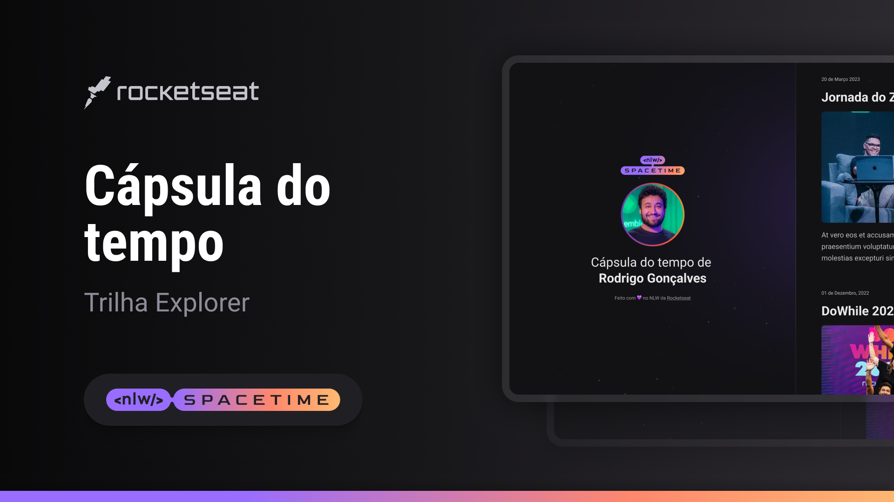

## 💻 Projeto
Esse é um projeto Web Responsivo de uma cápsula do tempo para exibir memórias em uma linha do tempo.

## 🚀 Tecnologias
Esse projeto foi desenvolvido durante a NLW da Rocketseat com as seguintes tecnologias:

- HTML
- CSS
- Git e Github

## 🏷️ Layout
Você pode visualizar o layout do projeto atavés [desse link](https://www.figma.com/file/EqYhOgQJ000i4bLd9kqyJ2/C%C3%A1psula-do-tempo-%E2%80%A2-Trilha-Explorer?type=design&node-id=0%3A1&t=tPAzCx8z3YTS40SL-1).
É necessário ter uma conta no [Figma](https://www.figma.com/)